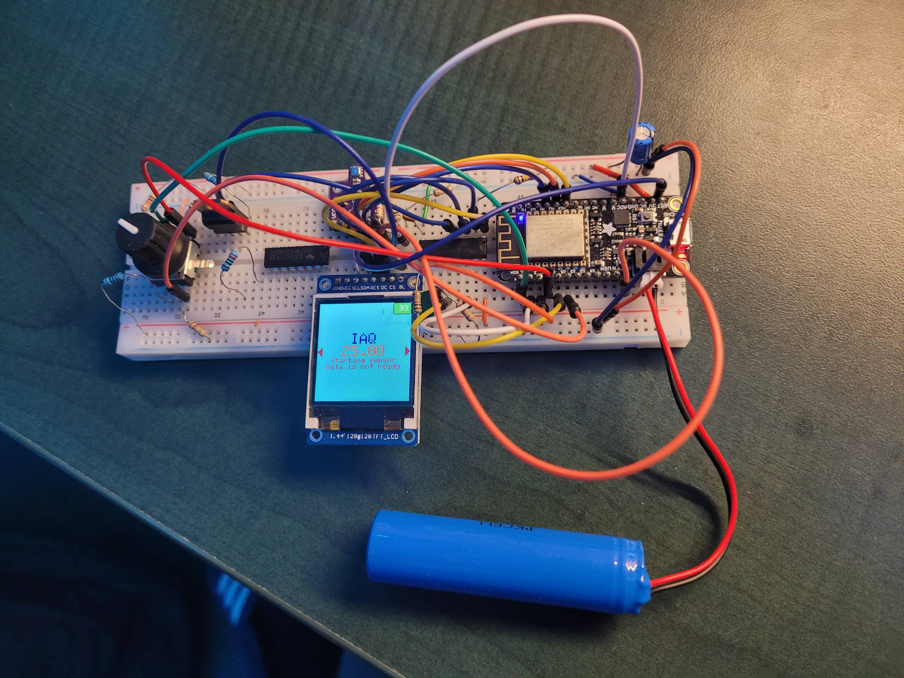

# Atmospheric Monitoring System
---
Version: 3.0.0

This is an ongoing project to create a portable atmospheric and air quality monitoring system.

## Features:
- Control of GUI using rotary encoder
- Displaying:
    - IAQ
    - Breath VOC Equivalent
    - Temperature
    - Humidity
    - Pressure
    - Battery level
